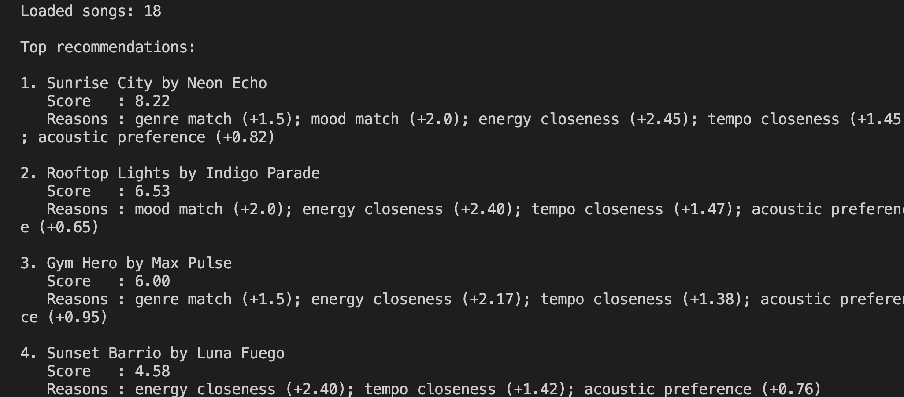
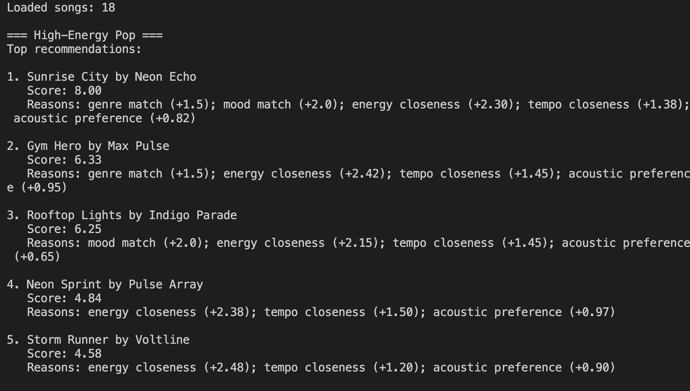
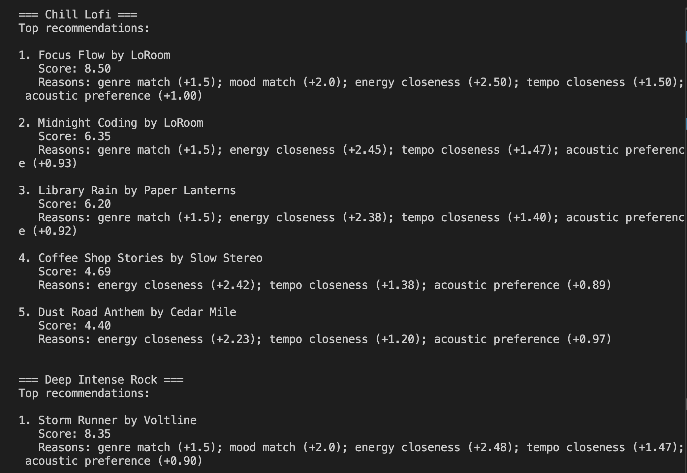
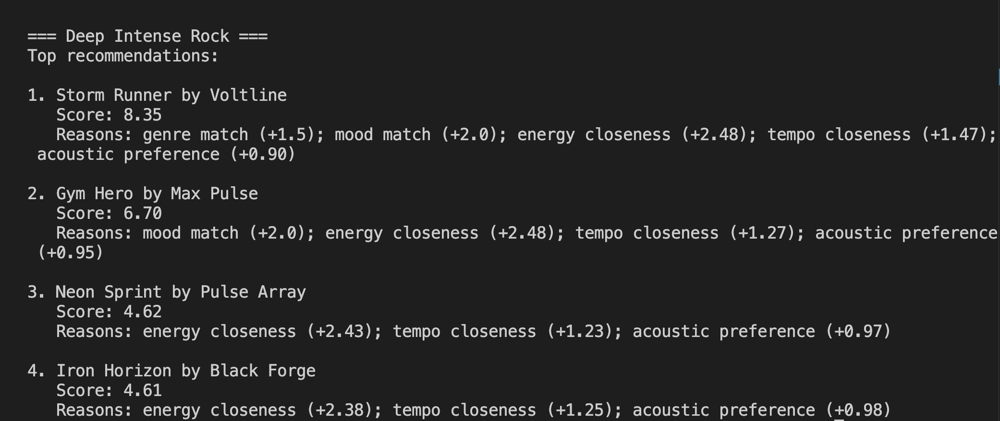
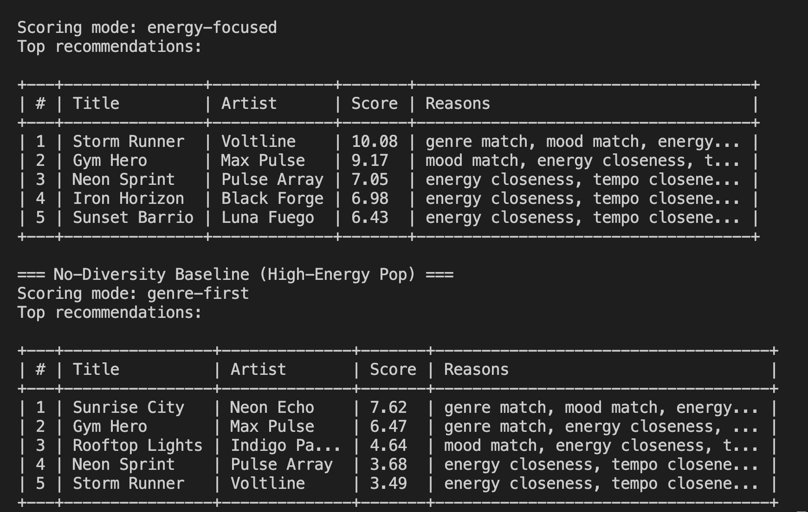

# 🎵 Music Recommender Simulation

### Project Summary

This project builds a small CLI-first music recommender that ranks songs from a CSV catalog, using user taste preferences like genre, mood, energy, tempo, and acousticness to score songs. This produces a ranked top-5 list with short reasons for each recommendation.

Multiple scoring modes and a diversity penalty are supported so the top results do not feel overly repetitive.

**Goals**:

- Represent songs and a user "taste profile" as data
- Turn that data into recommendations—design a scoring rule to do so
- Evaluate what your system gets right and wrong
- Reflect: How does this mirror real-world AI recommenders?

*My version focuses on transparent vibe matching instead of hidden machine learning.* 

---

## How The System Works

Real world recommender systems combine huge amounts of user behavior (plays, skips, likes, playlist adds, and session context) with song attributes, then rank millions of candidate tracks using learned models. At scale, platforms usually run this in stages: candidate generation, scoring, and final ranking with diversity and freshness rules. In this classroom simulation, I prioritize transparent, explainable matching over complexity: songs score higher when they are closer to the user's preferred vibe, and top recommendations are the highest scoring songs.

[**Model Card**](model_card.md): *Tool's technical specification detailing intended use, data limitations, and future improvements*

#### Song Features Used in This Simulation

- `id`
- `title`
- `artist`
- `genre`
- `mood`
- `energy`
- `tempo_bpm`
- `valence`
- `danceability`
- `acousticness`

#### UserProfile Features Used in This Simulation

- `favorite_genre`
- `favorite_mood`
- `target_energy`
- `target_tempo_bpm`
- `target_valence`
- `target_danceability`
- `likes_acoustic`
- `target_acousticness`

#### Scoring and Ranking Overview

- Score each song by how well its genre and mood match the user, and how close its numeric vibe features are to user preference.
- Attach short reasons to each score so recommendations are interpretable.
- Rank songs by score from highest to lowest and return the top `k` items.

#### Finalized Algorithm Recipe

- `+1.5` points for a genre match.
- `+2.0` points for a mood match.
- Up to `+2.5` points for energy closeness: `2.5 * (1 - abs(song_energy - target_energy))`.
- Up to `+1.5` points for tempo closeness (normalized): `1.5 * (1 - min(1, abs(song_tempo_bpm - target_tempo_bpm) / 120))`.
- Up to `+1.0` point for acoustic preference alignment.
- Final score is the sum; recommendations are the highest scoring songs.

#### Data and Profile Plan (Checkpoint)

- Dataset was expanded from 10 songs to 18 songs to improve genre and mood diversity.
- Initial user profile is tuned for a chill/focused vibe (lofi, focused mood, lower target energy, slower target tempo, higher acoustic preference).

#### Expected Biases

- This system may over-prioritize mood and energy, which can hide songs that are stylistically different but still enjoyable.
- Genre matching can still narrow discovery if weighted too strongly.
- A small catalog can make recommendations look repetitive even when the scoring rule is reasonable.

### System Evaluation

I tested the recommender with three different user profiles to see whether the top results changed in a sensible way:

- High-Energy Pop
- Chill Lofi
- Deep Intense Rock



*Loaded songs, Top recommendations, and the recommendation rows with title, score, and reasons*


### High-Energy Pop: 



### Chill Lofi:



### Deep Intense Rock:



### No-Diversity Baseline:



## Edge-Case User Profiles

*Stress-test your recommender—expose weaknesses in your scoring logic with these five adversarial profiles designed to trigger failure modes*

<details><summary>Adversarial Testing</summary> 
   
   1. **Melancholic Dancefloor** – High energy + sad mood
      - Tests whether conflicting continuous (energy) and categorical (mood) preferences cause contradictory recommendations
      - Exposes: Over-reliance on energy weight at the cost of mood match
   
   2. **Acoustic Metal Purist** – Metal genre + 85% acousticness
      - Metal is typically electric; this profile demands mutually exclusive features from the catalog
      - Exposes: Inability to handle preference combinations that may not exist in your song data
   
   3. **Genre Absolutist** – Extremely rare genre (e.g., "death-metal"), extreme energy (0.98), diverse no-repeat threshold
      - If your catalog has few songs in this genre, diversity penalties become meaningless
      - Exposes: Repetitive recommendations when preferred genres are scarce
   
   4. **Bland Centrist** – No genre/mood preference, all neutral continuous values (energy=0.5, tempo=100)
      - Removes binary preferences; recommendations depend entirely on continuous feature clustering
      - Exposes: Hidden biases in your song catalog (if most songs cluster around high energy, this user gets only that)
   
   5. **Ambidextrous Flip-Flopper** – Calm genre (lofi) + intense mood, low energy (0.10) but intense vibe
      - Multiple contradictory signals that force the system to pick one and ignore the other
      - Exposes: Lack of preference consistency checking; system favors one signal over another without explanation
   
   **How to evaluate:**
   - For each profile, generate recommendations and categorize failures:
     - ✗ Same songs repeated despite diversity penalty
     - ✗ Contradictory results (sad mood + upbeat songs)
     - ✗ No results or fallback behavior that breaks gracefully
   - Document which failure mode your system exhibits and why
   - Reflect: How could you redesign the scoring logic to handle these edge cases better?

</details>

---

## Getting Started

### Setup

1. Create a virtual environment (optional but recommended):

   ```bash
   python -m venv .venv
   source .venv/bin/activate      # Mac or Linux
   .venv\Scripts\activate         # Windows

2. Install dependencies

```bash
pip install -r requirements.txt
```

3. Run the app:

```bash
python -m src.main
```

### Running Tests

Run the starter tests with:

```bash
pytest
```

You can add more tests in `tests/test_recommender.py`.

---

### Experiments You Tried

I tried a weight-shift experiment where energy mattered more and genre mattered less.
That made the recommender favor songs with the right intensity even when the genre was not a perfect match.
I also tested several user profiles, like High-Energy Pop, Chill Lofi, and Deep Intense Rock, to see whether the results changed in a sensible way.
After that, I added a no-diversity baseline to compare how much the diversity penalty changes the top results.

---

### Limitations and Risks

The recommender can only work with a small catalog, so the results quickly repeat.
It doesn't have any real understanding of lyrics, artist context, or real listening history.
It also over-favor songs with a similar energy if its "weight" for it is too strong.
Some genres and moods have fewer examples, so those users may see less variety.
*These limits are discussed further in the model card.*

---

## 🎧 Model Card - VibeFinder 1.0
**Music Recommender Simulation**

*Combines `reflection.md` and `model_card.md` framing*

### Goal / Task
* Suggest songs from a small music catalog by matching a user's *vibe*
   * Use genre, mood, energy, tempo, and acousticness
* Ranked, top-5 list with short reasons for results output

### Data Used
* Dataset consists of 18 songs
   * Song attributes: id, title, artist, genre, mood, energy, tempo_bpm, valence, danceability, acousticness
   * User profile: favorite_genre, favorite_mood, target_energy, target_tempo_bpm, likes_acoustic, and target_acousticness
* Limitations: small catalog, no listening history, no lyric features

### Algorithm Summary
1. Each song gets points for matching genre and mood
2. Each song gets "similarity points" for energy and tempo closeness
3. Song receives an acoustic-preference score based on if the user likes acoustic songs
4. All points are then added
5. Songs sorted from highest to lowest score
6. System returns the top 5 songs and describes how each one scored well

### Observed Behavior / Biases
* System can create a "filter bubble" around energy
* If energy "weight" is high → Songs with similar intensity *reappear*, even for different genres
* Small catalog causes repeated artists and repeated "safe" recommendations → Issue of small dataset with small sample size
* Some moods and genres have fewer options → Those listeners get less variety

### Evaluation Process
1. Tested three profiles: *High-Energy Pop*, *Chill Lofi*, and *Deep Intense Rock*
2. Checked each profile for producing a different top song and different top-5 list
3. Adjusted parameters that affect recommendation results (e.g. halving genre weight and doubling energy weight)
   * Rcommendations became more intensity-driven and *less strict* about genre
4. Compared outputs across profiles and noted as such in `reflection.md`

### Intended Use and Non-Intended Use
**Intended use**: Learn basic recommender logic. Understand scoring, ranking, and explainability.

**Non-intended use**: Real music product decisions or personalized production recommendations. *Do not use for high-stakes decisions about users*

### Ideas for Improvement
1. Add more songs → Improve coverage and reduce repetition
2. Add diversity rules → Top-5 results are not too similar to each other
3. Add more user signals (e.g. skips, repeats, and playlist behavior)

# Personal Reflection
Biggest learning moment: seeing small "weight" changes reshape the whole ranking.

Although I still had to manually double-check outputs, especially when commands were typed incorrectly or when long terminal lines wrapped, AI tools helped me move faster when writing boilerplate and checking prompt design.

It was surprising to see that a simple weighted score could still feel like a real, legitimate recommendation engine.

*If I continue this project*, I'd add user behavior data and a diversity-aware "reranking" step.
